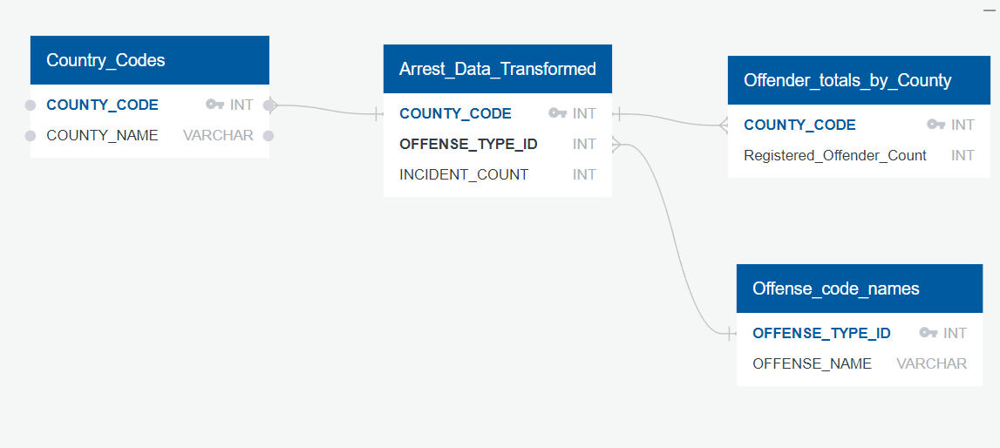

# Project 2 Extract, Transform, Load (ETL)

# Table of Contents
- [Project 2 Extract, Transform, Load (ETL)](#project-2-extract-transform-load-etl)
- [Table of Contents](#table-of-contents)
- [Project Motivation and Background](#project-motivation-and-background)
- [Technologies](#technologies)
- [Challenges - The ETL Process](#challenges---the-etl-process)
  - [Extraction](#extraction)
    - [Arrest Data Extraction](#arrest-data-extraction)
    - [Offender Data Extraction](#offender-data-extraction)
  - [Transformation](#transformation)
    - [Offense Codes Transformation](#offense-codes-transformation)
    - [Arrest Data Transformation](#arrest-data-transformation)
    - [Organizing Data](#organizing-data)
  - [Loading Data](#loading-data)
- [Presentation](#presentation)
- [Team Members](#team-members)

# Project Motivation and Background

Buying a house is one of the largest purchses that someone makes in thier lifetime.  People look at a variety of factors from price, size, location, school zones, and even crime rate.  Our project is focused on the crime rate factors and specifically crimes of sexual nature.  This new database can be used by prosepctive buyers and even realators to help with selecting a new house or location to live in.  

There are two main sources that we will be pulling our data from.  The frisy is from the Texas DPS website and once registered we can pull sex offender data.
https://publicsite.dps.texas.gov/SexOffenderRegistry/Home/Export

The second source is from the FBI Crime Data Exploxer.  With this source we were able to download the data from 2020 and specifically Texas.  This also carried much more data than we needed so we would have to work to filter the data out that was unnecessary.  
https://crime-data-explorer.fr.cloud.gov/pages/downloads

With both data sources we had to make sure that we only used and uploaded the parts that we would need since some of it might contain sensitive information.

# Technologies
To accomplish this we used a varitey of technologies including:
- Python
- SqLite
- Flask
- CSS
- HTML
- Bootstrap

# Challenges - The ETL Process
Some of the challenges that we had to overcome were data cleanup and the converstion of data from our extracted files to display on our flask app
## Extraction
- Sign up and acquire data from the FBI Crime Data Explorer and the Texas DPS Website
- Sort through the data and remove the files that we did not need or that had personal information that was not suitable to have online
### Arrest Data Extraction
- The arrest data was extracted from five different files consisting of NIBRS_ARRESTEE.csv, NIBRS_incident.csv, agencies.csv, NIBRS_OFFENSE_TYPE.csv, and Counties.txt.
- We loaded all the files into an Jupyter Notebook and worked step by step on the extraction.  
- Next we had to filter down only the offenses of a sexual nature and drop the rest.
- After that we filtered the data more by incidence_ID ad Agnecy_ID and merge the resulting tables.  With the Agency_ID in a table we were then able to connect the county name to the table so we now knew the county that the crime happened in.  
- The county.txt file connected the county name to a county_Code and once we merged this to the table we have extracted and combined all the columns we needed into one table.

### Offender Data Extraction
- For this Extraction we used the counties.txt and Adress.txt  Our first step was to convert the txt files into Pandas databases.  
- Once this was done we cleaned up the resulting dataframe by dropping na columns and then grouping by the COUNTY_CODE.  
- Then when this was completed we then merges the files together and it resulted in a table with a county code and Registered Offender count which we could reference once we started to transform the data.

## Transformation
### Offense Codes Transformation
- We started with the data from NIBRS_OFFENSE_TYPE and transformed it into a data set that we could reference.
- First we filtered by the columns that we would need including Offense type id and offense name and removed the remaining.
- Next we would use this data to find the ids that we would need for the remaining data transformations.
### Arrest Data Transformation
- We used our extracted data from the previous step and filtered it down to the fours columns that we would need.  From there we sorted it by county code.
- One of the challenges that we ran into was that when the data was converted to a csv file and the loaded back into a database it was loaded as a string and not a list.
- We had to use a lambda function to convert the county codes to lists since multiple counties were listed in a row.
- Once we did the conversion then we were able to use the explode method the make sure that each county code had its own row so we could properly count the incident counts per county.
- We summed out incident count in the end by county code.
### Organizing Data
- The last transformation was for data organization.
- We used the arrest_totals.csv and we slimed it down to include only the columns that we needed for the last step which is loading the data.

 
 

## Loading Data
Once the data was filtered and cleaned up our next step was to load the data into a form for our presentation.  To do this we used a python module that helped to convert the csv files into SQLite files.  
This is the following schema that we used when loading the data.

# Presentation
The data is presented by using Flask as a back end with HTML, CSS, and bootstrap on the front end.  In the web app you are able to put the country name into the URL and it will produce the sex offender data.  Since each county has a unique name you will be able to query all 254 counties and based on that data find a suitable place to live.

# Team Members
- [Annette Heredia](https://github.com/AnnetteHeredia)
- [Jordan Alonzo](https://github.com/jalonzoajordan)
- [Rachel Dowdy](https://github.com/radowtay)
- [Steven DeNoa](https://github.com/Stencoss/)